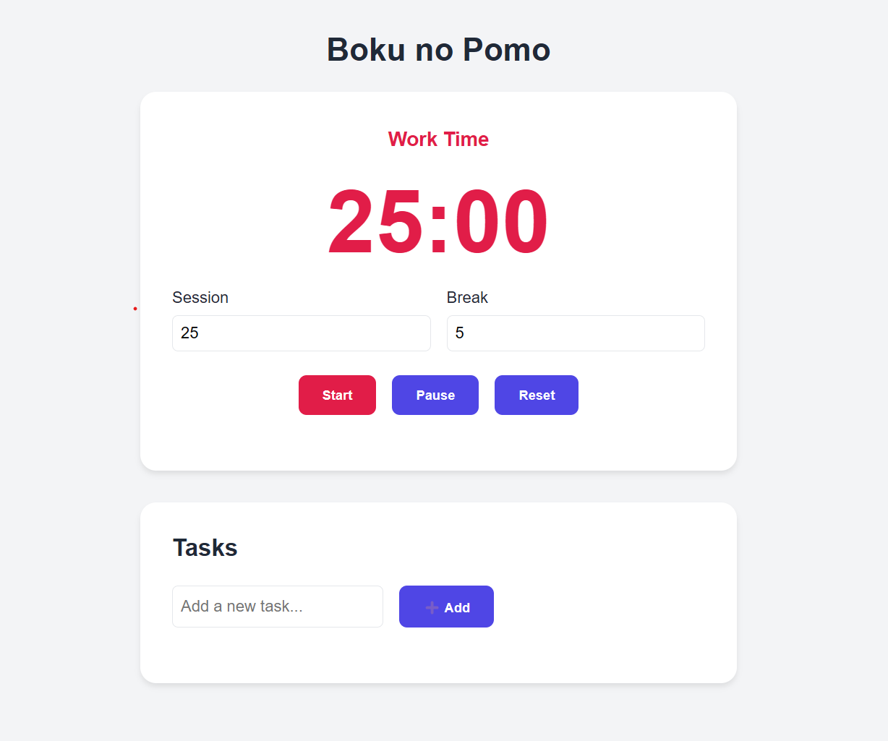

# Boku-no-Pomo 🕒

Boku no Pomo is a simple and effective Pomodoro Timer designed to help you stay productive by using the Pomodoro Technique. It includes a customizable timer, task management, and a clean UI.

## Features
- Set custom work and break durations
- Start, pause, and reset the timer
- Automatic switch between work and break modes
- Task management: Add tasks and mark them as complete
- Sound notification when the timer ends

## Installation & Usage
1. Clone or download this repository.
2. Open `index.html` in your web browser.
3. Set your desired session and break times.
4. Click "Start" to begin your Pomodoro session!

## Files
- `index.html` - Main structure of the app
- `styles.css` - Styling for the UI
- `script.js` - Timer and task logic

## Tech Stack
- HTML
- CSS
- JavaScript

## Screenshot

## Credits
Created by Varanasi Supradeep.  
Inspired by the Pomodoro Technique. ⏳
